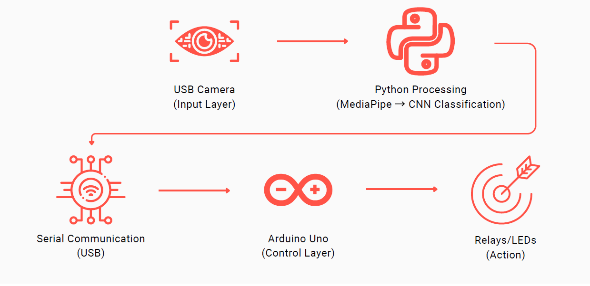
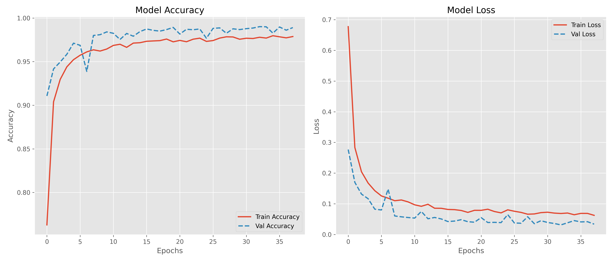
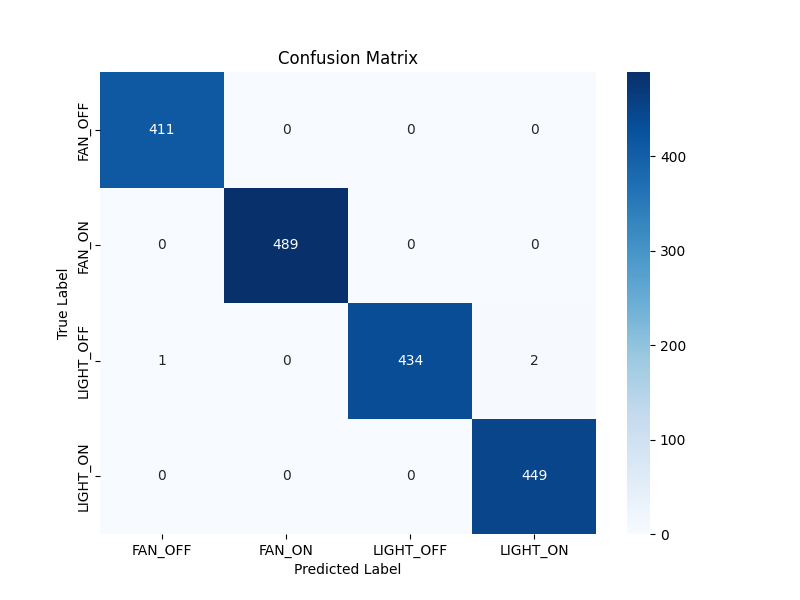

# Vision-Based Hand Gesture Recognition for Smart Home Control 🏠✋

**Senior Design Project - CMPE 491** **Istanbul Bilgi University**

**Authors:** Talha Erden, Emre Saygın  
**Advisor:** Prof. Dr. Doğan Çörüş

## 📖 Overview
This project bridges the gap between smart home technology and accessibility for hearing-impaired individuals. Instead of relying on voice assistants (like Alexa or Siri), this system allows users to control home appliances (lights, fans) using **static hand gestures** captured by a standard webcam.

The system achieves **99.8% accuracy** using a lightweight Artificial Neural Network (ANN) trained on skeletal features extracted by **Google MediaPipe**, making it efficient enough to run on standard CPUs without a GPU.



## 📊 Performance Analysis

The model demonstrates robust learning capabilities with minimal overfitting, achieving **99.8% validation accuracy** after 50 epochs.

### 1. Training Metrics
The graphs below visualize the Loss and Accuracy progression. The convergence of training and validation lines indicates stable learning.



### 2. Confusion Matrix
The model classifies 4 distinct gestures with high precision. Misclassification is negligible.

* **LIGHT_ON:** Open Palm 🖐️
* **LIGHT_OFF:** Closed Fist ✊
* **FAN_ON:** 'V' Sign ✌️
* **FAN_OFF:** Index Pointing ☝️



## 🎥 Real-Time Demonstration
The system captures hand landmarks in real-time using MediaPipe and classifies them instantly.

 

## 🚀 Key Features
* **Contactless Control:** Hygienic and accessible interaction.
* **High Accuracy:** 99.8% validation accuracy on a custom dataset of 9,000 images.
* **Low Latency:** Uses skeletal tracking (21 landmarks) instead of heavy CNN image processing.
* **Real-Time Actuation:** Integrates with Arduino via Serial Communication to control physical relays/LEDs.

## 🛠️ Tech Stack
* **Language:** Python 3.x
* **Computer Vision:** OpenCV, Google MediaPipe
* **Deep Learning:** TensorFlow / Keras (ANN)
* **Hardware:** Arduino Uno R3, Relay Modules
* **Communication:** PySerial (USB Serial)

## 📂 Project Structure

The project is organized as follows:

```text
├── arduino/           # C++ code (.ino) for Arduino Uno
├── dataset/           # Processed landmark dataset (CSV format)
├── models/            # Pre-trained .h5 models and label encoders
├── python/            # Python source codes (Training & Inference)
│   ├── collect_landmarks.py   # Script to extract landmarks from raw images
│   ├── train_model.py         # Script to train the ANN model
│   └── inference_serial.py    # Main script for Real-Time Control
├── requirements.txt   # List of dependencies
└── README.md          # Project documentation
